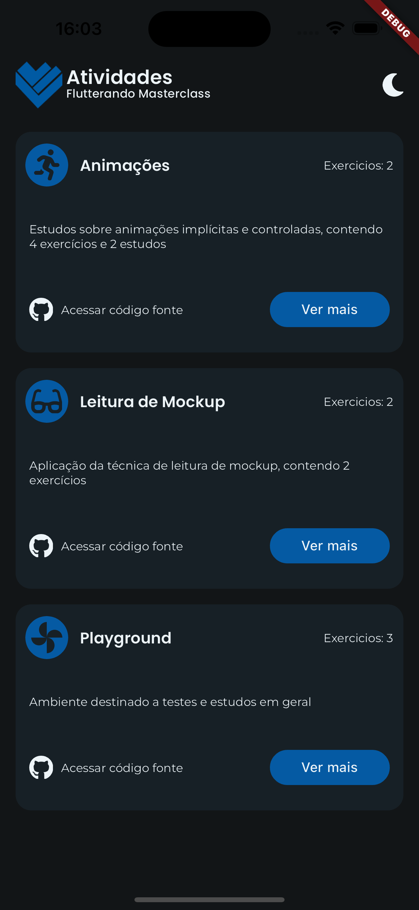
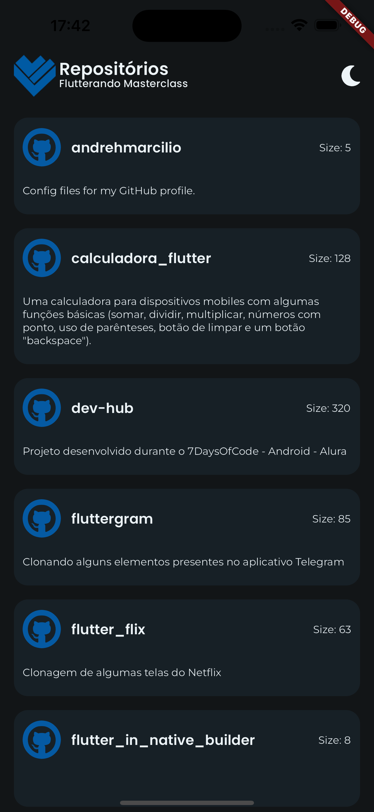
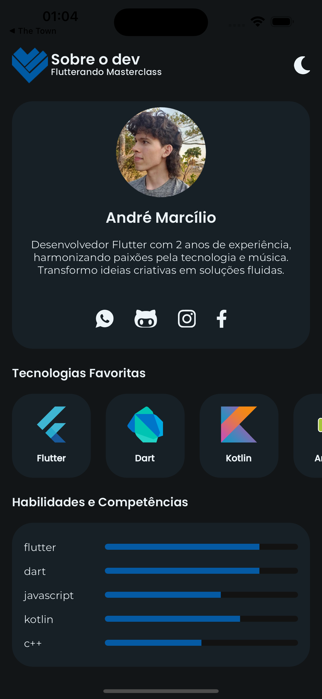
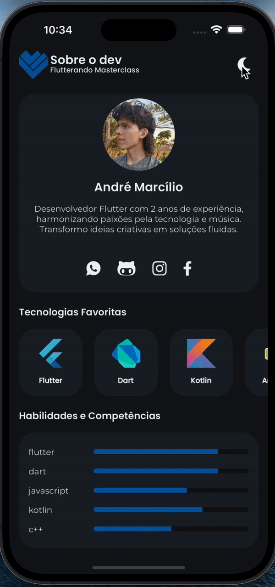

# masterclass_final_app

Compilation of applications, made with Flutter, developed during the 'Flutterando Masterclass' classes.

# how to run

To run the Flutter project and explore the various features, follow these steps:

Prerequisites: Make sure you have Flutter and Dart installed on your machine. If not, you can download them from the official Flutter website: [Flutter Installation Guide](https://docs.flutter.dev/get-started/install)

Clone the Repository: Open your terminal and navigate to the directory where you want to clone the repository. Then, execute the following command:

```bash
git clone https://github.com/your-username/masterclass_final_app.git
```
Navigate to the Project: Move into the project directory:

```bash
cd masterclass_final_app
```

Install Dependencies: In the project directory, run the following command to fetch and install the required dependencies:

```bash
flutter pub get
```

Run the App: After the dependencies are installed, you can launch the app using the following command:

```bash
flutter run
```

This will build and run the app on an available emulator or connected device.

# 1 Features

1. List of activities conducted during the classes.
2. List of exercices for each activitie (with examples).
3. List of repositories in my GitHub account.
4. Infos about me on a profile screen.
5. Light and Dark brightness mode.

## 1.1 List of activities conducted during the classes

This screen presents the user with a list of activities covered in the classes. Each activity is represented as a clickable component. When a user taps on an activity, it will navigate to the exercises screen.

The activity component must include:

The activitie component must has: 
- title.
- description.
- option to access source code (in gitHub).
- indicator with number of exercices.
- See more button (to navigate to exercices).

OBS: The data in this Screen is mocked, so no external requests are made.



## 1.2 List of exercices for each activity (with examples)

A screen that shows the user a List of exercices in the selected activitie. Each exercice is a clickable component. Tapping on an exercise navigates to the example screen.

The exercice component must has: 
- title.
- exercise number.

## 1.3 List of repositories in my GitHub account

In this feature, users can view the list of my repositories in my gitHub profile. This is achieved by making a request to the GitHub API. Tapping on a repository will open its URL in another application, such as a browser.

The repository component must include:
- title.
- description.
- repository size.

<br />



## 1.4 Infos about me on a profile screen

This feature presents a profile screen with information about me.

Information displayed includes:
- name.
- little bio.
- favorite programming tools.
- skill level.

<br />



## 1.5 Light and Dark brightness mode

This feature provides users with the option to switch between light and dark brightness modes. The selected mode will be saved for the next time the user accesses the app. If a theme mode has not been selected, the app will automatically utilize the platform's brightness settings.

<br />



# 2 Architecture

Access the project architecture info [here](./ARCHITECTURE.md)